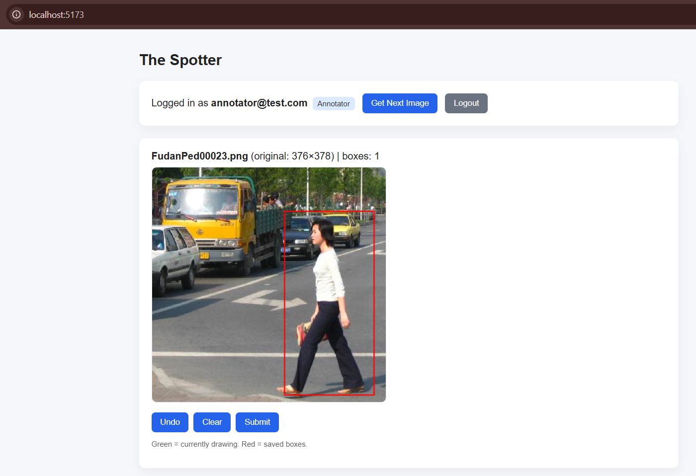
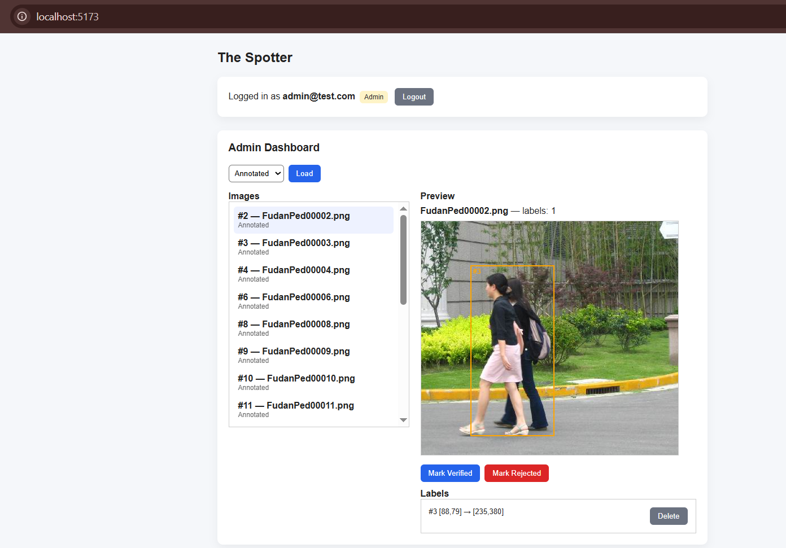

# 🧠 The Spotter — Human-in-the-Loop Annotation Tool

A full-stack pedestrian annotation system designed to generate high-quality training data for computer vision models.

This project implements an end-to-end workflow where annotators label pedestrians using bounding boxes and admins review label quality before data is used for training.

---

## 🚀 Overview

The Spotter simulates a production-style human-in-the-loop ML data pipeline. The system focuses on data quality, role-based workflows, and accurate coordinate handling.

Key goals:

- Pixel-accurate bounding box capture  
- Role-based access control  
- Image lifecycle management  
- Admin quality assurance workflow  
- Clean separation between UI and API responsibilities  

---

## 🏗️ Tech Stack

### Frontend
- React + TypeScript  
- HTML Canvas for interactive drawing  
- Axios for API communication  

### Backend
- Node.js + Express  
- SQLite (designed to be easily swappable for PostgreSQL)  
- JWT-based authentication  
- RESTful API design  

### Dataset
- Penn-Fudan Pedestrian Dataset  

---

## ✨ Key Features

### 🔹 Annotator Workspace

- Interactive click-and-drag bounding box drawing  
- Undo and clear controls  
- Multi-object support per image  
- Sequential image queue  
- Automatic coordinate transformation  

---

### 🔹 Coordinate Transformation Logic

Bounding boxes are:

- Drawn in **display space**
- Converted to **original image pixel space** before storage
- Re-scaled correctly in the Admin view

This ensures pixel-accurate annotations suitable for downstream ML training pipelines.

---

### 🔹 Admin Dashboard

- Browse annotated images  
- Visual overlay of submitted boxes  
- Delete inaccurate labels  
- Mark images as Verified or Rejected  
- Quality control workflow  

---

### 🔹 Security & Roles

- JWT-based authentication  
- Annotator vs Admin role separation  
- Server-side authorization enforcement  
- Protected admin endpoints  

---

### 🔹 Image Lifecycle

Images move through the following states:
    **Unlabeled → Annotated → Verified / Rejected**

This mirrors real-world human-in-the-loop ML data pipelines.

---

## 📸 Screenshots

### Annotator Workspace


### Admin Dashboard


---

## 🧪 How to Run Locally

### 1️⃣ Backend

```bash
cd server
npm install
npm run dev
```
#### Server Runs on:
    http://localhost:5000

### 2️⃣ Frontend
```bash
cd client
npm install
npm run dev
```
#### Frontend runs on:
    http://localhost:5173

## 🔐 Demo Credentials

### Annotator
    annotator@test.com
    password
### Admin
    admin@test.com
    password

---

## 📐 Architecture Notes

- Frontend handles interactive drawing and UI scaling.  
- Backend is the source of truth for:
  - authentication  
  - role enforcement  
  - lifecycle state  
  - label persistence  
- Bounding boxes are always stored relative to the **original image resolution** to maintain ML training quality.  
- The system is structured to be easily extensible to cloud storage and distributed workers.

---

## 🚧 Possible Future Improvements

- Image assignment locking for multi-annotator environments  
- Pre-annotation using ML models  
- PostgreSQL migration for scale  
- Annotation metrics dashboard  
- Audit logging for label changes  
- WebSocket live updates  

---

## 👤 Author

**Mokshik Trivedi**  
MSc Computer Science (AI), University of Nottingham

---
